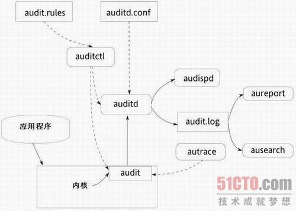

### Configuring System Auditing

###### About auditd

Linux内核有用日志记录事件的能力，比如记录系统调用和文件访问。然后管理员可以评审这些日志，确定可能存在的安全漏洞，比如失败的登录尝试，或者用户对系统文件不成功的访问, 这种功能称为Linux用户空间审计系统，在Red Hat Enterprise Linux 5及其之后版本中已经直接可用。当然老版本的Linux 也可以手工添加软件使用。

Linux在用户空间审计系统由auditd、audispd、auditctl、autrace、ausearch和aureport等应用程序组成。

审计后台auditd应用程序通过netlink机制从内核中接收审计消息，然后通过一个工作线程将审计消息写入到审计日志文件中，Linux的审核系统提供了一种记录系统安全信息的方法，为系统管理员在用户违反系统安全规则时提供及时的警告信息。内核其他线程通过内核审计API写入套接字缓冲区队列audit_skb_queue中，内核线程kauditd通过netlink机制将审计消息定向发送给用户控件的审计后台auditd的主线程，auditd主线程再通过事件队列将审计消息传给审计后台的写log文件线程，写入log文件。另一方面，审计后台还通过一个与套接字绑定的管道将审计消息发送给dispatcher应用程序。

图1是Linux audit架构示意图(实线代表数据流，虚线代表组件关之间的控制关系):




*    auditd： audit守护进程负责把内核产生的信息写入到硬盘上，这些信息是由应用程序和系统活动所触发产生的。audit守护进程如何启动取决于它的配置文件(/etc/sysconfig/auditd)。audit系统函数的启动受文件/etc/audit/auditd.conf的控制。在用户空间审计系统通过auditd后台进程接收内核审计系统传送来的审计信息，将信息写入到/var/log/audit/audit.log 中，audit.log的路径可在/etc/auditd.conf中指定。当auditd没有运行时，内核将审计信息传送给syslog，这些消息通常保存在/var/log/messages文件中，可以用dmesg命令查看。
*    auditctl： auditctl功能用来控制audit系统，它控制着生成日志的各种变量，以及内核审计的各种接口，还有决定跟踪哪些事件的规则。
*    audit.rules： 在/etc/audit/audit.rules中包含了一连串auditctl命令，这些命令在audit系统被启用的时候被立即加载。
*    aureport： aureport的功能是能够从审计日志里面提取并产生一个个性化的报告，这些日志报告很容易被脚本化，并能应用于各种应用程序之中，如去描述结果。
*    ausearch ： ausearch用于查询审计后台的日志，它能基于不同搜索规则的事件查询审计后台日志。每个系统调用进入内核空间运行时有个唯一的事件id，系统调用在进入内核后的运行过程的审计事件共享这个id。
*    audispd： audispd是消息分发的后台进程，用于将auditd后台发过来的一些消息通过syslog写入日志系统。这是一个审计调度进程，它可以将审计的信息转发给其它应用程序，而不是只能将审计日志写入硬盘上的审计日志文件之中。
*    autrace: 这个功能更总类似于strace，跟踪某一个进程，并将跟踪的结果写入日志文件之中。


要使用安全审计系统可采用下面的步骤：

*    安装软件包
*    了解配置文件
*    了解配置命令
*    添加审计规则和观察器来收集所需的数据
*    启用了内核中的audit并开始进行日志记录
*    通过生成审计报表和搜索日志来周期性地分析数据


###### Configuring auditd

*    auditd is the user-space component of the Linux auditing subsystem
*    auditctl can add auditing rules

*    /etc/sysconfig/auditd: startup options, normally parsed by the init script
*    /etc/audit/auditd.conf: main configuration file
*    /etc/audit/audit.rules: persistent auditing rules

*    service auditd status

###### Open Lab: Verify auditd Operation

```
# service auditd status
auditd (pid  1454) is running...
# chkconfig --list auditd
auditd         	0:off	1:off	2:on	3:on	4:on	5:on	6:off
# grep audit.log /etc/audit/auditd.conf 
log_file = /var/log/audit/audit.log

# tail -f /var/log/audit/audit.log
```


### Audit Reporting

###### Reading Audit Messages

> /var/log/audit/audit.log

```
# su - test     -> 执行切换到test用户操作，然后查看audit.log中的日志
[test] $ sudo ls
We trust you have received the usual lecture from the local System
Administrator. It usually boils down to these three things:
    #1) Respect the privacy of others.
    #2) Think before you type.
    #3) With great power comes great responsibility.
[sudo] password for test: 
test is not in the sudoers file.  This incident will be reported.

# tail -f /var/log/audit/audit.log
type=USER_AUTH msg=audit(1485313419.299:5467): user pid=7864 uid=0 auid=0 ses=393 subj=unconfined_u:unconfined_r:unconfined_t:s0-s0:c0.c1023 msg='op=PAM:authentication acct="test" exe="/bin/su" hostname=? addr=? terminal=pts/0 res=success'
type=USER_ACCT msg=audit(1485313419.299:5468): user pid=7864 uid=0 auid=0 ses=393 subj=unconfined_u:unconfined_r:unconfined_t:s0-s0:c0.c1023 msg='op=PAM:accounting acct="test" exe="/bin/su" hostname=? addr=? terminal=pts/0 res=success'
type=USER_START msg=audit(1485313419.312:5469): user pid=7864 uid=0 auid=0 ses=393 subj=unconfined_u:unconfined_r:unconfined_t:s0-s0:c0.c1023 msg='op=PAM:session_open acct="test" exe="/bin/su" hostname=? addr=? terminal=pts/0 res=success'
type=CRED_ACQ msg=audit(1485313419.312:5470): user pid=7864 uid=0 auid=0 ses=393 subj=unconfined_u:unconfined_r:unconfined_t:s0-s0:c0.c1023 msg='op=PAM:setcred acct="test" exe="/bin/su" hostname=? addr=? terminal=pts/0 res=success'


type=USER_AUTH msg=audit(1485313545.568:5471): user pid=7889 uid=500 auid=0 ses=393 subj=unconfined_u:unconfined_r:unconfined_t:s0-s0:c0.c1023 msg='op=PAM:authentication acct="test" exe="/usr/bin/sudo" hostname=? addr=? terminal=/dev/pts/0 res=success'
type=USER_ACCT msg=audit(1485313545.572:5472): user pid=7889 uid=500 auid=0 ses=393 subj=unconfined_u:unconfined_r:unconfined_t:s0-s0:c0.c1023 msg='op=PAM:accounting acct="test" exe="/usr/bin/sudo" hostname=? addr=? terminal=/dev/pts/0 res=success'
type=USER_CMD msg=audit(1485313545.574:5473): user pid=7889 uid=500 auid=0 ses=393 subj=unconfined_u:unconfined_r:unconfined_t:s0-s0:c0.c1023 msg='cwd="/home/test" cmd="ls" terminal=pts/0 res=failed'
type=USER_ACCT msg=audit(1485313801.247:5474): user pid=7901 uid=0 auid=4294967295 ses=4294967295 subj=system_u:system_r:crond_t:s0-s0:c0.c1023 msg='op=PAM:accounting acct="root" exe="/usr/sbin/crond" hostname=? addr=? terminal=cron res=success'
type=CRED_ACQ msg=audit(1485313801.248:5475): user pid=7901 uid=0 auid=4294967295 ses=4294967295 subj=system_u:system_r:crond_t:s0-s0:c0.c1023 msg='op=PAM:setcred acct="root" exe="/usr/sbin/crond" hostname=? addr=? terminal=cron res=success'
type=LOGIN msg=audit(1485313801.250:5476): pid=7901 uid=0 subj=system_u:system_r:crond_t:s0-s0:c0.c1023 old auid=4294967295 new auid=0 old ses=4294967295 new ses=829
type=USER_START msg=audit(1485313801.258:5477): user pid=7901 uid=0 auid=0 ses=829 subj=system_u:system_r:crond_t:s0-s0:c0.c1023 msg='op=PAM:session_open acct="root" exe="/usr/sbin/crond" hostname=? addr=? terminal=cron res=success'
type=CRED_DISP msg=audit(1485313801.326:5478): user pid=7901 uid=0 auid=0 ses=829 subj=system_u:system_r:crond_t:s0-s0:c0.c1023 msg='op=PAM:setcred acct="root" exe="/usr/sbin/crond" hostname=? addr=? terminal=cron res=success'
type=USER_END msg=audit(1485313801.326:5479): user pid=7901 uid=0 auid=0 ses=829 subj=system_u:system_r:crond_t:s0-s0:c0.c1023 msg='op=PAM:session_close acct="root" exe="/usr/sbin/crond" hostname=? addr=? terminal=cron res=success'

type=
auid=
uid=
euid=
pid=
exe=
comm=
res=
key=

# date --date=@1485313419
Tue Jan 24 22:03:39 EST 2017
# date --date=@1485313545
Tue Jan 24 22:05:45 EST 2017

```

###### Searching for Events

> ausearch

```
# ausearch -c su
<no matches>

# ausearch -a 5467
----
time->Tue Jan 24 22:03:39 2017
type=USER_AUTH msg=audit(1485313419.299:5467): user pid=7864 uid=0 auid=0 ses=393 subj=unconfined_u:unconfined_r:unconfined_t:s0-s0:c0.c1023 msg='op=PAM:authentication acct="test" exe="/bin/su" hostname=? addr=? terminal=pts/0 res=success'

# ausearch -a 5467 -i
----
type=USER_AUTH msg=audit(01/24/2017 22:03:39.299:5467) : user pid=7864 uid=root auid=root ses=393 subj=unconfined_u:unconfined_r:unconfined_t:s0-s0:c0.c1023 msg='op=PAM:authentication acct=test exe=/bin/su hostname=? addr=? terminal=pts/0 res=success' 

# ausearch -m LOGIN --raw
type=LOGIN msg=audit(1484883601.286:20): pid=6229 uid=0 subj=system_u:system_r:crond_t:s0-s0:c0.c1023 old auid=4294967295 new auid=0 old ses=4294967295 new ses=1
type=LOGIN msg=audit(1484884201.381:26): pid=6234 uid=0 subj=system_u:system_r:crond_t:s0-s0:c0.c1023 old auid=4294967295 new auid=0 old ses=4294967295 new ses=2
type=LOGIN msg=audit(1484884801.466:32): pid=6240 uid=0 subj=system_u:system_r:crond_t:s0-s0:c0.c1023 old auid=4294967295 new auid=0 old ses=4294967295 new ses=3
type=LOGIN msg=audit(1484884861.533:38): pid=6246 uid=0 subj=system_u:system_r:crond_t:s0-s0:c0.c1023 old auid=4294967295 new auid=0 old ses=4294967295 new ses=4
...

# ausearch -m LOGIN --raw | grep 5476
type=LOGIN msg=audit(1485313801.250:5476): pid=7901 uid=0 subj=system_u:system_r:crond_t:s0-s0:c0.c1023 old auid=4294967295 new auid=0 old ses=4294967295 new ses=829

# ausearch -m USER_AUTH --raw | grep 5467
type=USER_AUTH msg=audit(1485313419.299:5467): user pid=7864 uid=0 auid=0 ses=393 subj=unconfined_u:unconfined_r:unconfined_t:s0-s0:c0.c1023 msg='op=PAM:authentication acct="test" exe="/bin/su" hostname=? addr=? terminal=pts/0 res=success'

# ausearch -k ""
```

```
# ausearch --help
usage: ausearch [options]
	-a,--event <Audit event id>	search based on audit event id
	--arch <CPU>			search based on the CPU architecture
	-c,--comm  <Comm name>		search based on command line name
	--checkpoint <checkpoint file>	search from last complete event
	--debug			Write malformed events that are skipped to stderr
	-e,--exit  <Exit code or errno>	search based on syscall exit code
	-f,--file  <File name>		search based on file name
	-ga,--gid-all <all Group id>	search based on All group ids
	-ge,--gid-effective <effective Group id>  search based on Effective
					group id
	-gi,--gid <Group Id>		search based on group id
	-h,--help			help
	-hn,--host <Host Name>		search based on remote host name
	-i,--interpret			Interpret results to be human readable
	-if,--input <Input File name>	use this file instead of current logs
	--input-logs			Use the logs even if stdin is a pipe
	--just-one			Emit just one event
	-k,--key  <key string>		search based on key field
	-l, --line-buffered		Flush output on every line
	-m,--message  <Message type>	search based on message type
	-n,--node  <Node name>		search based on machine's name
	-o,--object  <SE Linux Object context> search based on context of object
	-p,--pid  <Process id>		search based on process id
	-pp,--ppid <Parent Process id>	search based on parent process id
	-r,--raw			output is completely unformatted
	-sc,--syscall <SysCall name>	search based on syscall name or number
	-se,--context <SE Linux context> search based on either subject or
					 object
	--session <login session id>	search based on login session id
	-su,--subject <SE Linux context> search based on context of the Subject
	-sv,--success <Success Value>	search based on syscall or event
					success value
	-te,--end [end date] [end time]	ending date & time for search
	-ts,--start [start date] [start time]	starting data & time for search
	-tm,--terminal <TerMinal>	search based on terminal
	-ua,--uid-all <all User id>	search based on All user id's
	-ue,--uid-effective <effective User id>  search based on Effective
					user id
	-ui,--uid <User Id>		search based on user id
	-ul,--loginuid <login id>	search based on the User's Login id
	-uu,--uuid <guest UUID>		search for events related to the virtual
					machine with the given UUID.
	-v,--version			version
	-vm,--vm-name <guest name>	search for events related to the virtual
					machine with the name.
	-w,--word			string matches are whole word
	-x,--executable <executable name>  search based on executable name
```

###### Reporting on Audit Messages

> aureport

```
# aureport --executable --summary

Executable Summary Report
=================================
total  file
=================================
4220  /usr/sbin/crond
540  /usr/sbin/sshd
48  /bin/su
24  /usr/bin/passwd
23  /usr/sbin/useradd
13  /usr/sbin/userdel
12  /sbin/runuser
9  /usr/bin/chage
3  /usr/sbin/aide
2  /sbin/shutdown
2  /usr/sbin/groupadd
2  /usr/bin/sudo
1  /sbin/pam_tally2

```

```
# aureport --help
usage: aureport [options]
	-a,--avc			Avc report
	-au,--auth			Authentication report
	--comm				Commands run report
	-c,--config			Config change report
	-cr,--crypto			Crypto report
	-e,--event			Event report
	-f,--file			File name report
	--failed			only failed events in report
	-h,--host			Remote Host name report
	--help				help
	-i,--interpret			Interpretive mode
	-if,--input <Input File name>	use this file as input
	--input-logs			Use the logs even if stdin is a pipe
	--integrity			Integrity event report
	-l,--login			Login report
	-k,--key			Key report
	-m,--mods			Modification to accounts report
	-ma,--mac			Mandatory Access Control (MAC) report
	-n,--anomaly			aNomaly report
	-nc,--no-config			Don't include config events
	--node <node name>		Only events from a specific node
	-p,--pid			Pid report
	-r,--response			Response to anomaly report
	-s,--syscall			Syscall report
	--success			only success events in report
	--summary			sorted totals for main object in report
	-t,--log			Log time range report
	-te,--end [end date] [end time]	ending date & time for reports
	-tm,--terminal			TerMinal name report
	-ts,--start [start date] [start time]	starting data & time for reports
	--tty				Report about tty keystrokes
	-u,--user			User name report
	-v,--version			Version
	--virt				Virtualization report
	-x,--executable			eXecutable name report
	If no report is given, the summary report will be displayed
```

###### Open Lab: Audit Reporting


### Writing Custom Audit Rules

```
# auditctl -w /etc/passwd -p wa -k user-edit
# auditctl -w /bin -p x
# auditctl -l
```

```
# auditctl --help
usage: auditctl [options]
    -a <l,a>            Append rule to end of <l>ist with <a>ction
    -A <l,a>            Add rule at beginning of <l>ist with <a>ction
    -b <backlog>        Set max number of outstanding audit buffers
                        allowed Default=64
    -c                  Continue through errors in rules
    -C f=f              Compare collected fields if available:
                        Field name, operator(=,!=), field name
    -d <l,a>            Delete rule from <l>ist with <a>ction
                        l=task,exit,user,exclude
                        a=never,always
    -D                  Delete all rules and watches
    -e [0..2]           Set enabled flag
    -f [0..2]           Set failure flag
                        0=silent 1=printk 2=panic
    -F f=v              Build rule: field name, operator(=,!=,<,>,<=,
                        >=,&,&=) value
    -h                  Help
    -i                  Ignore errors when reading rules from file
    -k <key>            Set filter key on audit rule
    -l                  List rules
    -m text             Send a user-space message
    -p [r|w|x|a]        Set permissions filter on watch
                        r=read, w=write, x=execute, a=attribute
    -q <mount,subtree>  make subtree part of mount point's dir watches
    -r <rate>           Set limit in messages/sec (0=none)
    -R <file>           read rules from file
    -s                  Report status
    -S syscall          Build rule: syscall name or number
    -t                  Trim directory watches
    -v                  Version
    -w <path>           Insert watch at <path>
    -W <path>           Remove watch at <path>
```

###### Adding Rules

```
# auditctl -l
No rules
# auditctl -w /etc/ -p wa -k "config-change"
# auditctl -l
-w /etc/ -p wa -k config-change

# touch /etc/file1
# chmod 755 /etc/file1 

# tail -f /var/log/audit/audit.log
type=SYSCALL msg=audit(1485322527.166:5589): arch=c000003e syscall=59 success=yes exit=0 a0=b79570 a1=b61c70 a2=b5c380 a3=18 items=2 ppid=18533 pid=8080 auid=0 uid=0 gid=0 euid=0 suid=0 fsuid=0 egid=0 sgid=0 fsgid=0 tty=pts2 ses=30 comm="touch" exe="/bin/touch" subj=unconfined_u:unconfined_r:unconfined_t:s0-s0:c0.c1023 key=(null)
type=EXECVE msg=audit(1485322527.166:5589): argc=2 a0="touch" a1="/etc/file1"
type=CWD msg=audit(1485322527.166:5589):  cwd="/root"
type=PATH msg=audit(1485322527.166:5589): item=0 name="/bin/touch" inode=2625171 dev=fd:00 mode=0100755 ouid=0 ogid=0 rdev=00:00 obj=system_u:object_r:bin_t:s0 nametype=NORMAL
type=PATH msg=audit(1485322527.166:5589): item=1 name=(null) inode=399990 dev=fd:00 mode=0100755 ouid=0 ogid=0 rdev=00:00 obj=system_u:object_r:ld_so_t:s0 nametype=NORMAL
type=SYSCALL msg=audit(1485322527.168:5590): arch=c000003e syscall=2 success=yes exit=3 a0=7ffc2924a504 a1=941 a2=1b6 a3=388338f9ec items=2 ppid=18533 pid=8080 auid=0 uid=0 gid=0 euid=0 suid=0 fsuid=0 egid=0 sgid=0 fsgid=0 tty=pts2 ses=30 comm="touch" exe="/bin/touch" subj=unconfined_u:unconfined_r:unconfined_t:s0-s0:c0.c1023 key="config-change"
type=CWD msg=audit(1485322527.168:5590):  cwd="/root"
type=PATH msg=audit(1485322527.168:5590): item=0 name="/etc/" inode=1703937 dev=fd:00 mode=040755 ouid=0 ogid=0 rdev=00:00 obj=system_u:object_r:etc_t:s0 nametype=PARENT
type=PATH msg=audit(1485322527.168:5590): item=1 name="/etc/file1" inode=1704077 dev=fd:00 mode=0100644 ouid=0 ogid=0 rdev=00:00 obj=unconfined_u:object_r:etc_t:s0 nametype=CREATE

type=SYSCALL msg=audit(1485322640.592:5591): arch=c000003e syscall=59 success=yes exit=0 a0=b61be0 a1=b785b0 a2=b5c380 a3=20 items=2 ppid=18533 pid=8081 auid=0 uid=0 gid=0 euid=0 suid=0 fsuid=0 egid=0 sgid=0 fsgid=0 tty=pts2 ses=30 comm="chmod" exe="/bin/chmod" subj=unconfined_u:unconfined_r:unconfined_t:s0-s0:c0.c1023 key=(null)
type=EXECVE msg=audit(1485322640.592:5591): argc=3 a0="chmod" a1="755" a2="/etc/file1"
type=CWD msg=audit(1485322640.592:5591):  cwd="/root"
type=PATH msg=audit(1485322640.592:5591): item=0 name="/bin/chmod" inode=2624527 dev=fd:00 mode=0100755 ouid=0 ogid=0 rdev=00:00 obj=system_u:object_r:bin_t:s0 nametype=NORMAL
type=PATH msg=audit(1485322640.592:5591): item=1 name=(null) inode=399990 dev=fd:00 mode=0100755 ouid=0 ogid=0 rdev=00:00 obj=system_u:object_r:ld_so_t:s0 nametype=NORMAL
type=SYSCALL msg=audit(1485322640.595:5592): arch=c000003e syscall=268 success=yes exit=0 a0=ffffffffffffff9c a1=f840f0 a2=1ed a3=0 items=1 ppid=18533 pid=8081 auid=0 uid=0 gid=0 euid=0 suid=0 fsuid=0 egid=0 sgid=0 fsgid=0 tty=pts2 ses=30 comm="chmod" exe="/bin/chmod" subj=unconfined_u:unconfined_r:unconfined_t:s0-s0:c0.c1023 key="config-change"
type=CWD msg=audit(1485322640.595:5592):  cwd="/root"
type=PATH msg=audit(1485322640.595:5592): item=0 name="/etc/file1" inode=1704077 dev=fd:00 mode=0100644 ouid=0 ogid=0 rdev=00:00 obj=unconfined_u:object_r:etc_t:s0 nametype=NORMAL

# ausearch -k config-change
----
time->Wed Jan 25 00:35:27 2017
type=PATH msg=audit(1485322527.168:5590): item=1 name="/etc/file1" inode=1704077 dev=fd:00 mode=0100644 ouid=0 ogid=0 rdev=00:00 obj=unconfined_u:object_r:etc_t:s0 nametype=CREATE
type=PATH msg=audit(1485322527.168:5590): item=0 name="/etc/" inode=1703937 dev=fd:00 mode=040755 ouid=0 ogid=0 rdev=00:00 obj=system_u:object_r:etc_t:s0 nametype=PARENT
type=CWD msg=audit(1485322527.168:5590):  cwd="/root"
type=SYSCALL msg=audit(1485322527.168:5590): arch=c000003e syscall=2 success=yes exit=3 a0=7ffc2924a504 a1=941 a2=1b6 a3=388338f9ec items=2 ppid=18533 pid=8080 auid=0 uid=0 gid=0 euid=0 suid=0 fsuid=0 egid=0 sgid=0 fsgid=0 tty=pts2 ses=30 comm="touch" exe="/bin/touch" subj=unconfined_u:unconfined_r:unconfined_t:s0-s0:c0.c1023 key="config-change"
----
time->Wed Jan 25 00:37:20 2017
type=PATH msg=audit(1485322640.595:5592): item=0 name="/etc/file1" inode=1704077 dev=fd:00 mode=0100644 ouid=0 ogid=0 rdev=00:00 obj=unconfined_u:object_r:etc_t:s0 nametype=NORMAL
type=CWD msg=audit(1485322640.595:5592):  cwd="/root"
type=SYSCALL msg=audit(1485322640.595:5592): arch=c000003e syscall=268 success=yes exit=0 a0=ffffffffffffff9c a1=f840f0 a2=1ed a3=0 items=1 ppid=18533 pid=8081 auid=0 uid=0 gid=0 euid=0 suid=0 fsuid=0 egid=0 sgid=0 fsgid=0 tty=pts2 ses=30 comm="chmod" exe="/bin/chmod" subj=unconfined_u:unconfined_r:unconfined_t:s0-s0:c0.c1023 key="config-change"

# ausearch -k config-change -i
----
type=PATH msg=audit(01/25/2017 00:35:27.168:5590) : item=1 name=/etc/file1 inode=1704077 dev=fd:00 mode=file,644 ouid=root ogid=root rdev=00:00 obj=unconfined_u:object_r:etc_t:s0 nametype=CREATE 
type=PATH msg=audit(01/25/2017 00:35:27.168:5590) : item=0 name=/etc/ inode=1703937 dev=fd:00 mode=dir,755 ouid=root ogid=root rdev=00:00 obj=system_u:object_r:etc_t:s0 nametype=PARENT 
type=CWD msg=audit(01/25/2017 00:35:27.168:5590) :  cwd=/root 
type=SYSCALL msg=audit(01/25/2017 00:35:27.168:5590) : arch=x86_64 syscall=open success=yes exit=3 a0=0x7ffc2924a504 a1=O_WRONLY|O_CREAT|O_NOCTTY|O_NONBLOCK a2=0666 a3=0x388338f9ec items=2 ppid=18533 pid=8080 auid=root uid=root gid=root euid=root suid=root fsuid=root egid=root sgid=root fsgid=root tty=pts2 ses=30 comm=touch exe=/bin/touch subj=unconfined_u:unconfined_r:unconfined_t:s0-s0:c0.c1023 key=config-change 
----
type=PATH msg=audit(01/25/2017 00:37:20.595:5592) : item=0 name=/etc/file1 inode=1704077 dev=fd:00 mode=file,644 ouid=root ogid=root rdev=00:00 obj=unconfined_u:object_r:etc_t:s0 nametype=NORMAL 
type=CWD msg=audit(01/25/2017 00:37:20.595:5592) :  cwd=/root 
type=SYSCALL msg=audit(01/25/2017 00:37:20.595:5592) : arch=x86_64 syscall=fchmodat success=yes exit=0 a0=0xffffffffffffff9c a1=0xf840f0 a2=0755 a3=0x0 items=1 ppid=18533 pid=8081 auid=root uid=root gid=root euid=root suid=root fsuid=root egid=root sgid=root fsgid=root tty=pts2 ses=30 comm=chmod exe=/bin/chmod subj=unconfined_u:unconfined_r:unconfined_t:s0-s0:c0.c1023 key=config-change 

# ausearch --start today -k config-change -i 

# auditctl -w /bin -p x
# auditctl -l
-w /etc/ -p wa -k config-change
-w /bin/ -p x

##### audit -w /bin -p x -F "uid!=0"
# auditctl -w /bin -p x -F "uid>=500" -k "unprivileged-execute"
# auditctl -l
-w /etc/ -p wa -k config-change
-w /bin/ -p x
-a always,exit -S all -F dir=/bin -F perm=x -F uid>=500 -F key=unprivileged-execute

# su - test
[test]$ ls

# tail -f /var/log/audit/audit.log
type=SYSCALL msg=audit(1485323432.503:5614): arch=c000003e syscall=59 success=yes exit=0 a0=1745350 a1=1744340 a2=1749aa0 a3=18 items=2 ppid=7865 pid=8107 auid=0 uid=500 gid=500 euid=500 suid=500 fsuid=500 egid=500 sgid=500 fsgid=500 tty=pts0 ses=393 comm="ls" exe="/bin/ls" subj=unconfined_u:unconfined_r:unconfined_t:s0-s0:c0.c1023 key=(null)
type=EXECVE msg=audit(1485323432.503:5614): argc=2 a0="ls" a1="--color=auto"
type=CWD msg=audit(1485323432.503:5614):  cwd="/home/test"
type=PATH msg=audit(1485323432.503:5614): item=0 name="/bin/ls" inode=2626015 dev=fd:00 mode=0100755 ouid=0 ogid=0 rdev=00:00 obj=system_u:object_r:bin_t:s0 nametype=NORMAL
type=PATH msg=audit(1485323432.503:5614): item=1 name=(null) inode=399990 dev=fd:00 mode=0100755 ouid=0 ogid=0 rdev=00:00 obj=system_u:object_r:ld_so_t:s0 nametype=NORMAL


```

###### Removing Rules

> auditctl -D

```
# auditctl -l
-w /etc/ -p wa -k config-change
-w /bin/ -p x
-a always,exit -S all -F dir=/bin -F perm=x -F uid>=500 -F key=unprivileged-execute
# auditctl -D
No rules
# auditctl -l
No rules
```

###### Inspecting Rules

> auditctl -l 

###### Immutable Rules

> auditctl -s [012]

*   0: disable auditing
*   1: enables auditing again
*   2: make your rules immutable; Rules can no longer be added, removed, or changed, and the auditing subsystem can no longer be stopped. Before any changes can be made the entire system will need to be rebooted.

```
# auditctl -s
enabled 1
failure 1
pid 1454
rate_limit 0
backlog_limit 320
lost 0
backlog 0
```

###### Persistent Rules

> /etc/audit/audit.rules

```
# auditctl -D
No rules

# vim /etc/audit/audit.rules 
-w /etc/ -p wa -k "config-change"
-w /bin -p x -F uid>=500 -k "unprivileged-execute"

# service auditd restart
Stopping auditd: [  OK  ]
Starting auditd: [  OK  ]

# auditctl -l
-w /etc/ -p wa -k "config-change"
-a always,exit -S all -F dir=/bin -F perm=x -F uid>=500 -F key="unprivileged-execute"
```

###### Using Predefined Audit Sets

> /usr/share/doc/audit-*/*.rules

> Copy to /etc/audit/audit.rules

```
# ll /usr/share/doc/audit-2.4.5/*.rules
-rw-r--r--. 1 root root 10513 Dec 18  2015 /usr/share/doc/audit-2.4.5/capp.rules
-rw-r--r--. 1 root root 11668 Dec 18  2015 /usr/share/doc/audit-2.4.5/lspp.rules
-rw-r--r--. 1 root root  6840 Apr  4  2016 /usr/share/doc/audit-2.4.5/nispom.rules
-rw-r--r--. 1 root root  9063 Dec 18  2015 /usr/share/doc/audit-2.4.5/stig.rules

```

### Log Ratation

*    service auditd rotate

A sample script that you can drop into /etc/cron.d/* is in /usr/share/doc/audit-*/audit.cron

```
# service auditd
Usage: /etc/init.d/auditd {start|stop|status|restart|condrestart|try-restart|reload|force-reload|rotate|resume}

# ls /var/log/audit/
audit.log
# service auditd rotate
Rotating logs: [  OK  ]
# ls /var/log/audit/
audit.log  audit.log.1

# vim /etc/audit/auditd.conf
log_file = /var/log/audit/audit.log
max_log_file = 6

# cat /usr/share/doc/audit-2.4.5/auditd.cron
#!/bin/sh
##########
# This script can be installed to get a daily log rotation
# based on a cron job.
##########
/sbin/service auditd rotate
EXITVALUE=$?
if [ $EXITVALUE != 0 ]; then
    /usr/bin/logger -t auditd "ALERT exited abnormally with [$EXITVALUE]"
fi
exit 0

# cp /usr/share/doc/audit-2.4.5/auditd.cron /etc/cron
cron.d/       cron.daily/   cron.deny     cron.hourly/  cron.monthly/ crontab       cron.weekly/  
# cp /usr/share/doc/audit-2.4.5/auditd.cron /etc/cron.daily/
```

### Remote Logging with auditd

There are 2 main ways to send audit messages to a remote system.both methods use custom Audit Dispatching with audispd. audispd is configured in /etc/audisp/audispd.conf, with plug-ins configured in /etc/audisp/plugins.d/*.conf

### Unit Test: Implementing a Custom Audit Policy


